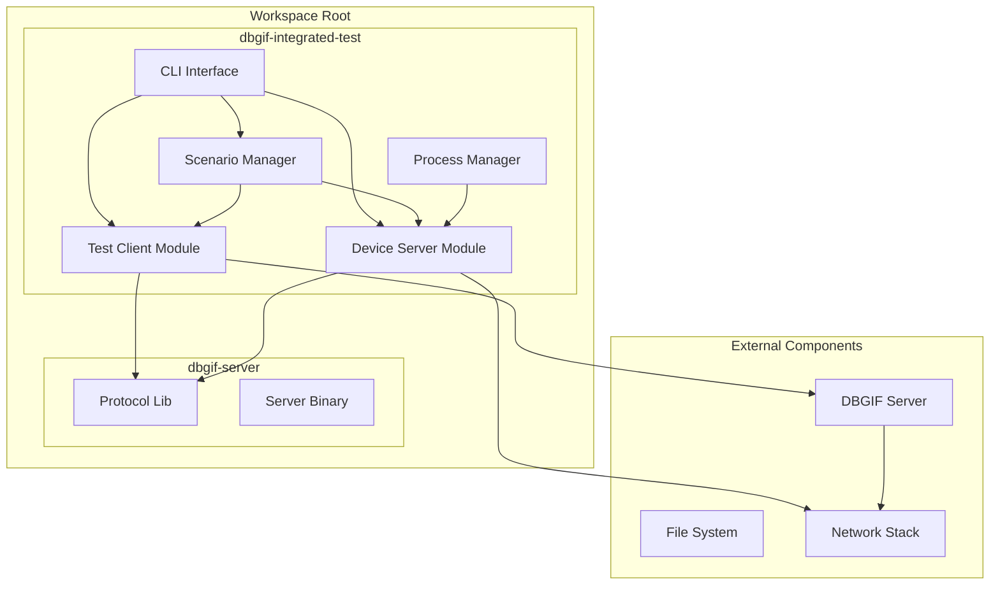
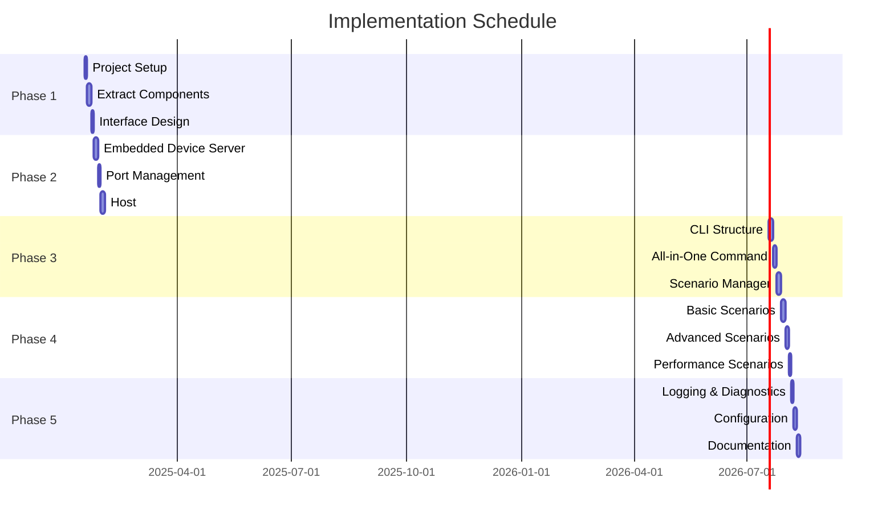

# DBGIF Integrated Test Implementation Plan

## Executive Summary

This document outlines the plan to create a separate workspace member `dbgif-integrated-test` that merges functionality from `dbgif-test-client` and `tcp-device-test-server` into a comprehensive testing framework. This workspace separation ensures clean architecture, independent versioning, and better modularity while simplifying end-to-end testing through automatic device server lifecycle management and `host:connect` integration.

## Goals

1. **Simplify Testing**: Single command to run complete test scenarios
2. **Automate Setup**: Automatic device server spawning and connection
3. **Improve DX**: Better developer experience with intuitive commands
4. **Enable CI/CD**: Easy integration with automated testing pipelines
5. **Clean Architecture**: Separate workspace for test infrastructure

## Architecture Overview



## Task Breakdown

### Phase 1: Foundation [P1]

#### TASK-001: Workspace Setup
- **Status**: TODO
- **Assignee**: TBD
- **Dependencies**: None
- **Description**: Create separate workspace member for integrated test
- **Deliverables**:
  - [ ] Update root `Cargo.toml` to include workspace member
  - [ ] Create `dbgif-integrated-test/Cargo.toml`
  - [ ] Setup directory structure for new crate
  - [ ] Configure dependencies on `dbgif-protocol` crate

#### TASK-002: Module Structure Setup
- **Status**: TODO
- **Assignee**: TBD
- **Dependencies**: TASK-001
- **Description**: Create module structure within new workspace member
- **Deliverables**:
  - [ ] Create `dbgif-integrated-test/src/lib.rs`
  - [ ] Create `dbgif-integrated-test/src/client/mod.rs`
  - [ ] Create `dbgif-integrated-test/src/device/mod.rs`
  - [ ] Create `dbgif-integrated-test/src/scenarios/mod.rs`
  - [ ] Create `dbgif-integrated-test/src/process/mod.rs`

#### TASK-003: Extract and Port Components
- **Status**: TODO
- **Assignee**: TBD
- **Dependencies**: TASK-002
- **Description**: Port code from existing binaries to new workspace
- **Deliverables**:
  - [ ] Port test client logic from `dbgif-test-client`
  - [ ] Port device server logic from `tcp-device-test-server`
  - [ ] Refactor for library usage
  - [ ] Create shared utilities module

### Phase 2: Core Implementation [P2]

#### TASK-004: Embedded Device Server
- **Status**: TODO
- **Assignee**: TBD
- **Dependencies**: TASK-003
- **Description**: Implement device server as embedded module
- **Deliverables**:
  - [ ] Port device server logic to module
  - [ ] Add lifecycle management (start/stop)
  - [ ] Implement health checking
  - [ ] Add configuration options

```rust
// Example API
pub struct EmbeddedDeviceServer {
    config: DeviceConfig,
    handle: Option<JoinHandle<()>>,
    port: u16,
}

impl EmbeddedDeviceServer {
    pub async fn spawn(config: DeviceConfig) -> Result<Self>;
    pub async fn stop(&mut self) -> Result<()>;
    pub fn port(&self) -> u16;
    pub async fn health_check(&self) -> Result<bool>;
}
```

#### TASK-005: Port Management
- **Status**: TODO
- **Assignee**: TBD
- **Dependencies**: TASK-004
- **Description**: Automatic port allocation and management
- **Deliverables**:
  - [ ] Find available port function
  - [ ] Port reservation mechanism
  - [ ] Conflict detection
  - [ ] Port range configuration

#### TASK-006: Host:Connect Integration
- **Status**: TODO
- **Assignee**: TBD
- **Dependencies**: TASK-005
- **Description**: Implement automatic device connection via host:connect
- **Deliverables**:
  - [ ] Auto-connect after device spawn
  - [ ] Connection verification
  - [ ] Retry logic with backoff
  - [ ] Error handling and recovery

```rust
// Example flow
async fn setup_device_connection(
    client: &mut TestClient,
    device_port: u16,
) -> Result<()> {
    // Wait for device server to be ready
    wait_for_port(device_port).await?;

    // Send host:connect command
    client.send_command(&format!("host:connect:127.0.0.1:{}", device_port)).await?;

    // Verify connection
    let devices = client.list_devices().await?;
    ensure!(devices.contains("test-device-001"));

    Ok(())
}
```

### Phase 3: CLI Implementation [P3]

#### TASK-007: CLI Structure with Clap
- **Status**: TODO
- **Assignee**: TBD
- **Dependencies**: TASK-006
- **Description**: Implement comprehensive CLI using clap
- **Deliverables**:
  - [ ] Main command structure
  - [ ] Subcommand definitions
  - [ ] Argument parsing
  - [ ] Help documentation

```rust
#[derive(Parser)]
struct Cli {
    #[command(subcommand)]
    command: Commands,

    #[arg(long, default_value = "127.0.0.1:5555")]
    server: String,

    #[arg(short, long)]
    verbose: bool,
}

#[derive(Subcommand)]
enum Commands {
    /// Run everything automatically
    AllInOne {
        #[arg(long, default_value = "1")]
        devices: usize,

        #[arg(long)]
        scenario: Option<String>,
    },

    /// Start only device server(s)
    DeviceServer {
        #[arg(long, default_value = "1")]
        count: usize,

        #[arg(long)]
        ports: Vec<u16>,
    },

    /// Run specific test scenario
    Scenario {
        name: String,

        #[arg(long)]
        config: Option<PathBuf>,
    },

    /// Interactive test mode
    Interactive,
}
```

#### TASK-008: All-in-One Command
- **Status**: TODO
- **Assignee**: TBD
- **Dependencies**: TASK-007
- **Description**: Implement the main all-in-one test command
- **Deliverables**:
  - [ ] Spawn device servers
  - [ ] Connect to DBGIF server
  - [ ] Run default test suite
  - [ ] Clean shutdown handling

#### TASK-009: Scenario Manager
- **Status**: TODO
- **Assignee**: TBD
- **Dependencies**: TASK-008
- **Description**: Implement scenario-based testing
- **Deliverables**:
  - [ ] Scenario definition format
  - [ ] Scenario loader
  - [ ] Step executor
  - [ ] Result validation

### Phase 4: Test Scenarios [P4]

#### TASK-010: Basic Scenarios
- **Status**: TODO
- **Assignee**: TBD
- **Dependencies**: TASK-009
- **Description**: Implement fundamental test scenarios
- **Deliverables**:
  - [ ] Connection handshake test
  - [ ] Host services test
  - [ ] Stream multiplexing test
  - [ ] Error handling test

```yaml
# Example scenario definition
name: basic_flow
description: Basic end-to-end flow test
steps:
  - name: setup
    action: spawn_device
    params:
      count: 1

  - name: connect
    action: host_connect
    params:
      device: 0

  - name: verify
    action: list_devices
    expect:
      count: 1

  - name: communicate
    action: send_command
    params:
      command: "shell:echo test"
    expect:
      response: "test"
```

#### TASK-011: Advanced Scenarios
- **Status**: TODO
- **Assignee**: TBD
- **Dependencies**: TASK-010
- **Description**: Complex multi-device scenarios
- **Deliverables**:
  - [ ] Multi-device connection
  - [ ] Concurrent stream handling
  - [ ] Load testing scenario
  - [ ] Failure recovery scenario

#### TASK-012: Performance Scenarios
- **Status**: TODO
- **Assignee**: TBD
- **Dependencies**: TASK-011
- **Description**: Performance and stress testing
- **Deliverables**:
  - [ ] Throughput measurement
  - [ ] Latency testing
  - [ ] Connection limit testing
  - [ ] Memory leak detection

### Phase 5: Integration & Polish [P5]

#### TASK-013: Logging and Diagnostics
- **Status**: TODO
- **Assignee**: TBD
- **Dependencies**: TASK-012
- **Description**: Enhanced logging and debugging capabilities
- **Deliverables**:
  - [ ] Structured logging with tracing
  - [ ] Color-coded output by component
  - [ ] Timing information
  - [ ] Debug dump capability

#### TASK-014: Configuration Management
- **Status**: TODO
- **Assignee**: TBD
- **Dependencies**: TASK-013
- **Description**: External configuration support
- **Deliverables**:
  - [ ] Config file format (TOML/YAML)
  - [ ] Environment variable support
  - [ ] Default configurations
  - [ ] Config validation

#### TASK-015: Documentation
- **Status**: TODO
- **Assignee**: TBD
- **Dependencies**: TASK-014
- **Description**: Comprehensive documentation
- **Deliverables**:
  - [ ] User guide
  - [ ] Scenario writing guide
  - [ ] API documentation
  - [ ] Examples directory


## Implementation Timeline



## Usage Examples

### Basic Usage

```bash
# Run everything with defaults
cargo run --bin dbgif-integrated-test -- all-in-one

# Run with multiple devices
cargo run --bin dbgif-integrated-test -- all-in-one --devices 3

# Run specific scenario
cargo run --bin dbgif-integrated-test -- scenario basic_flow

# Start only device servers
cargo run --bin dbgif-integrated-test -- device-server --count 2 --ports 5557,5558

# Interactive mode
cargo run --bin dbgif-integrated-test -- interactive
```

### Advanced Usage

```bash
# Custom configuration
cargo run --bin dbgif-integrated-test -- all-in-one --config test-config.yaml

# Performance testing
cargo run --bin dbgif-integrated-test -- scenario performance --duration 60 --connections 100

# Debug mode with detailed logging
RUST_LOG=debug cargo run --bin dbgif-integrated-test -- all-in-one --verbose

# CI/CD integration
./scripts/run-integration-tests.sh --junit-output results.xml
```

## Success Criteria

1. **Functionality**
   - [ ] All existing test client features work
   - [ ] Device server can be embedded and controlled
   - [ ] Host:connect integration works reliably
   - [ ] Scenarios execute correctly

2. **Performance**
   - [ ] Startup time < 1 second
   - [ ] No memory leaks in long-running tests
   - [ ] Support 10+ concurrent device servers
   - [ ] Minimal overhead vs separate binaries

3. **Usability**
   - [ ] Single command for common tasks
   - [ ] Clear error messages
   - [ ] Helpful documentation
   - [ ] Intuitive CLI interface

4. **Maintainability**
   - [ ] Modular architecture
   - [ ] Comprehensive tests
   - [ ] Clean code with good separation
   - [ ] Easy to extend with new scenarios

## Risk Assessment

### Technical Risks

1. **Port Conflicts**
   - Mitigation: Implement robust port allocation with retry logic

2. **Process Management Complexity**
   - Mitigation: Use tokio tasks instead of OS processes where possible

3. **Synchronization Issues**
   - Mitigation: Proper async/await patterns and timeouts

### Schedule Risks

1. **Scope Creep**
   - Mitigation: Strict adherence to MVP features

2. **Integration Complexity**
   - Mitigation: Incremental integration with continuous testing

## Appendix A: File Structure

```
workspace-root/
├── Cargo.toml                           # Workspace root configuration
├── dbgif-server/                        # Main server crate
│   ├── Cargo.toml
│   ├── src/
│   └── ...
├── dbgif-protocol/                      # Protocol library crate
│   ├── Cargo.toml
│   ├── src/
│   └── ...
├── dbgif-integrated-test/               # New workspace member
│   ├── Cargo.toml
│   ├── src/
│   │   ├── lib.rs                       # Library root
│   │   ├── bin/
│   │   │   └── dbgif-integrated-test.rs # Binary entry point
│   │   ├── client/
│   │   │   ├── mod.rs                   # Test client module
│   │   │   ├── ascii.rs                 # ASCII protocol client
│   │   │   └── connection.rs            # Connection management
│   │   ├── device/
│   │   │   ├── mod.rs                   # Device server module
│   │   │   ├── server.rs                # Embedded server impl
│   │   │   └── config.rs                # Device configuration
│   │   ├── scenarios/
│   │   │   ├── mod.rs                   # Scenario framework
│   │   │   ├── basic.rs                 # Basic test scenarios
│   │   │   ├── advanced.rs              # Advanced scenarios
│   │   │   └── performance.rs           # Performance tests
│   │   ├── process/
│   │   │   ├── mod.rs                   # Process management
│   │   │   └── manager.rs               # Process lifecycle
│   │   └── utils/
│   │       ├── mod.rs                   # Utilities
│   │       ├── ports.rs                 # Port management
│   │       └── logging.rs               # Logging setup
│   ├── tests/                           # Unit tests
│   ├── examples/                        # Usage examples
│   └── scenarios/                       # Scenario definitions
│       ├── basic_flow.yaml
│       ├── multi_device.yaml
│       └── performance.yaml
└── docs/
    ├── integrated-test-plan.md          # This document
    └── integrated-test-guide.md         # User guide (TBD)
```

## Appendix B: Workspace Configuration

### Root Cargo.toml
```toml
[workspace]
members = [
    "dbgif-server",
    "dbgif-protocol",
    "dbgif-integrated-test",
]
resolver = "2"

[workspace.dependencies]
tokio = { version = "1.41", features = ["full"] }
async-trait = "0.1"
thiserror = "2.0"
anyhow = "1.0"
tracing = "0.1"
tracing-subscriber = { version = "0.3", features = ["env-filter"] }
clap = { version = "4.5", features = ["derive"] }
serde = { version = "1.0", features = ["derive"] }
serde_yaml = "0.9"
```

### dbgif-integrated-test/Cargo.toml
```toml
[package]
name = "dbgif-integrated-test"
version = "0.1.0"
edition = "2021"

[dependencies]
dbgif-protocol = { path = "../dbgif-protocol" }
tokio = { workspace = true }
async-trait = { workspace = true }
thiserror = { workspace = true }
anyhow = { workspace = true }
tracing = { workspace = true }
tracing-subscriber = { workspace = true }
clap = { workspace = true }
serde = { workspace = true }
serde_yaml = { workspace = true }
uuid = { version = "1.11", features = ["v4", "serde"] }
rand = "0.8"

[[bin]]
name = "dbgif-integrated-test"
path = "src/bin/dbgif-integrated-test.rs"

[dev-dependencies]
mockall = "0.13"
tokio-test = "0.4"
```

## Appendix C: Test Configuration Schema

```yaml
# Example test configuration file
version: 1.0

server:
  address: 127.0.0.1:5555
  timeout: 30

devices:
  count: 2
  base_port: 5557
  startup_delay: 100ms

scenarios:
  default: basic_flow
  timeout: 60s

logging:
  level: info
  format: pretty
  color: true

test:
  retry_count: 3
  retry_delay: 1s
```

## Next Steps

1. Review and approve this plan
2. Create project structure (TASK-001)
3. Begin implementation in phases
4. Regular progress reviews at phase boundaries
5. Continuous testing and validation

## Change Log

| Date | Version | Changes | Author |
|------|---------|---------|---------|
| 2025-01-17 | 1.0.0 | Initial plan creation | AI Assistant |