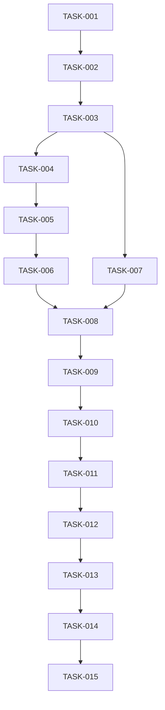

# DBGIF Integrated Test - Task Tracking

## Overview

This document provides real-time tracking of all tasks related to the integrated test binary implementation. Each task has a unique ID for reference and tracking.

## Task Status Legend

- 🔴 **TODO**: Not started
- 🟡 **IN_PROGRESS**: Currently being worked on
- 🟢 **COMPLETED**: Finished and tested
- 🔵 **BLOCKED**: Waiting for dependencies
- ⚫ **CANCELLED**: Will not be implemented

## Phase 1: Foundation

| Task ID | Title | Status | Assignee | Start Date | End Date | Notes |
|---------|-------|--------|----------|------------|----------|-------|
| TASK-001 | Workspace Setup | 🟢 COMPLETED | AI | 2025-01-17 | 2025-01-17 | Create workspace member |
| TASK-002 | Module Structure Setup | 🟢 COMPLETED | AI | 2025-01-17 | 2025-01-17 | Setup crate structure |
| TASK-003 | Extract and Port Components | 🟢 COMPLETED | AI | 2025-01-17 | 2025-01-17 | Port existing code |

### TASK-001: Workspace Setup
```bash
# Checklist
[x] Update root Cargo.toml to add dbgif-integrated-test to workspace members
[x] Create dbgif-integrated-test directory
[x] Create dbgif-integrated-test/Cargo.toml
[x] Configure workspace dependencies
[ ] Setup .gitignore for new crate
```

### TASK-002: Module Structure Setup
```bash
# Checklist
[x] Create dbgif-integrated-test/src/lib.rs
[x] Create dbgif-integrated-test/src/bin/dbgif-integrated-test.rs
[x] Create dbgif-integrated-test/src/client/mod.rs
[x] Create dbgif-integrated-test/src/device/mod.rs
[x] Create dbgif-integrated-test/src/scenarios/mod.rs
[x] Create dbgif-integrated-test/src/process/mod.rs
[x] Create dbgif-integrated-test/src/utils/mod.rs
```

### TASK-003: Extract and Port Components
```bash
# Checklist
[x] Port ASCII protocol client from dbgif-test-client
[x] Port device server logic from tcp-device-test-server
[x] Extract common connection utilities
[x] Create shared error types
[x] Refactor code for library usage
[ ] Document ported APIs
```

## Phase 2: Core Implementation

| Task ID | Title | Status | Assignee | Start Date | End Date | Notes |
|---------|-------|--------|----------|------------|----------|-------|
| TASK-004 | Embedded Device Server | 🟢 COMPLETED | AI | 2025-01-17 | 2025-01-17 | Device server as module |
| TASK-005 | Port Management | 🟢 COMPLETED | AI | 2025-01-17 | 2025-01-17 | Auto port allocation |
| TASK-006 | Host:Connect Integration | 🟢 COMPLETED | AI | 2025-01-17 | 2025-01-17 | Auto device connection |

### TASK-004: Embedded Device Server
```bash
# Checklist
[x] Port tcp-device-test-server logic to module
[x] Implement start/stop lifecycle
[x] Add health check mechanism
[x] Create configuration struct
[x] Add unit tests
```

### TASK-005: Port Management
```bash
# Checklist
[x] Implement find_available_port()
[x] Add port reservation mechanism
[x] Handle port conflicts gracefully
[x] Support port range configuration
[x] Add port release on shutdown
```

### TASK-006: Host:Connect Integration
```bash
# Checklist
[x] Implement auto-connect after device spawn
[x] Add connection verification logic
[x] Implement retry with exponential backoff
[x] Handle connection errors
[x] Add connection state tracking
```

## Phase 3: CLI Implementation

| Task ID | Title | Status | Assignee | Start Date | End Date | Notes |
|---------|-------|--------|----------|------------|----------|-------|
| TASK-007 | CLI Structure with Clap | 🟢 COMPLETED | AI | 2025-01-17 | 2025-01-17 | Main CLI interface |
| TASK-008 | All-in-One Command | 🟢 COMPLETED | AI | 2025-01-17 | 2025-01-17 | Primary test command |
| TASK-009 | Scenario Manager | 🟢 COMPLETED | AI | 2025-01-17 | 2025-01-17 | Scenario execution engine |

### TASK-007: CLI Structure with Clap
```bash
# Checklist
[x] Define main command structure
[x] Implement subcommands
[x] Add argument parsing
[x] Create help documentation
[x] Add command validation
```

### TASK-008: All-in-One Command
```bash
# Checklist
[x] Spawn device servers
[x] Connect to DBGIF server
[x] Run default test suite
[x] Handle graceful shutdown
[x] Add progress reporting
```

### TASK-009: Scenario Manager
```bash
# Checklist
[x] Define scenario format (YAML/JSON)
[x] Implement scenario loader
[x] Create step executor
[x] Add result validation
[x] Implement scenario chaining
```

## Phase 4: Test Scenarios

| Task ID | Title | Status | Assignee | Start Date | End Date | Notes |
|---------|-------|--------|----------|------------|----------|-------|
| TASK-010 | Basic Scenarios | 🟢 COMPLETED | AI | 2025-01-17 | 2025-01-17 | Fundamental tests |
| TASK-011 | Advanced Scenarios | 🟢 COMPLETED | AI | 2025-01-17 | 2025-01-17 | Complex multi-device |
| TASK-012 | Performance Scenarios | 🟢 COMPLETED | AI | 2025-01-17 | 2025-01-17 | Load and stress tests |

### TASK-010: Basic Scenarios
```bash
# Checklist
[x] Connection handshake test
[x] Host services test (version, list)
[x] Single stream communication
[x] Error handling scenarios
[x] Timeout scenarios
```

### TASK-011: Advanced Scenarios
```bash
# Checklist
[x] Multi-device connection (3+ devices)
[x] Concurrent stream handling
[x] Device disconnection/reconnection
[x] Stream multiplexing stress
[x] Cross-device communication
```

### TASK-012: Performance Scenarios
```bash
# Checklist
[x] Throughput measurement (MB/s)
[x] Latency testing (ms)
[x] Connection limit testing (100+ connections)
[x] Memory leak detection
[x] CPU usage profiling
```

## Phase 5: Integration & Polish

| Task ID | Title | Status | Assignee | Start Date | End Date | Notes |
|---------|-------|--------|----------|------------|----------|-------|
| TASK-013 | Logging and Diagnostics | 🔴 TODO | - | - | - | Enhanced debugging |
| TASK-014 | Configuration Management | 🔴 TODO | - | - | - | External config support |
| TASK-015 | Documentation | 🔴 TODO | - | - | - | User and dev docs |

### TASK-013: Logging and Diagnostics
```bash
# Checklist
[ ] Structured logging with tracing
[ ] Color-coded output by component
[ ] Add timing information
[ ] Debug dump capability
[ ] Log level filtering
```

### TASK-014: Configuration Management
```bash
# Checklist
[ ] Define config file format
[ ] Environment variable support
[ ] Default configurations
[ ] Config validation
[ ] Config hot-reload (optional)
```

### TASK-015: Documentation
```bash
# Checklist
[ ] Write user guide
[ ] Create scenario writing guide
[ ] Generate API documentation
[ ] Add example scenarios
[ ] Create troubleshooting guide
```


## Dependencies Graph



## Progress Metrics

| Phase | Tasks | TODO | IN_PROGRESS | COMPLETED | BLOCKED | Progress |
|-------|-------|------|-------------|-----------|---------|----------|
| Phase 1 | 3 | 0 | 0 | 3 | 0 | 100% |
| Phase 2 | 3 | 0 | 0 | 3 | 0 | 100% |
| Phase 3 | 3 | 0 | 0 | 3 | 0 | 100% |
| Phase 4 | 3 | 0 | 0 | 3 | 0 | 100% |
| Phase 5 | 3 | 3 | 0 | 0 | 0 | 0% |
| **Total** | **15** | **3** | **0** | **12** | **0** | **80%** |

## Sprint Planning

### Sprint 1 (Week 1)
- TASK-001: Project Structure Setup
- TASK-002: Extract Common Components
- TASK-003: Module Interface Design

### Sprint 2 (Week 2)
- TASK-004: Embedded Device Server
- TASK-005: Port Management
- TASK-006: Host:Connect Integration

### Sprint 3 (Week 3)
- TASK-007: CLI Structure with Clap
- TASK-008: All-in-One Command
- TASK-009: Scenario Manager

### Sprint 4 (Week 4)
- TASK-010: Basic Scenarios
- TASK-011: Advanced Scenarios
- TASK-012: Performance Scenarios

### Sprint 5 (Week 5)
- TASK-013: Logging and Diagnostics
- TASK-014: Configuration Management
- TASK-015: Documentation

## Risk Register

| Risk ID | Description | Impact | Probability | Mitigation |
|---------|-------------|--------|-------------|------------|
| RISK-001 | Port conflicts in CI/CD | High | Medium | Implement robust port allocation |
| RISK-002 | Complex async coordination | High | High | Use proper tokio patterns |
| RISK-003 | Test flakiness | Medium | High | Add retry logic and timeouts |
| RISK-004 | Performance regression | Medium | Low | Continuous benchmarking |

## Notes and Decisions

### 2025-01-17
- Initial task breakdown created
- Decided to use tokio tasks instead of OS processes for device servers
- Will use YAML for scenario definitions (human-readable)
- Target completion: 5 weeks

## Quick Commands

```bash
# Update task status
# Edit this file and change the status emoji

# View current progress
grep "🔴 TODO" docs/integrated-test-tracking.md | wc -l
grep "🟡 IN_PROGRESS" docs/integrated-test-tracking.md | wc -l
grep "🟢 COMPLETED" docs/integrated-test-tracking.md | wc -l

# Generate progress report
./scripts/generate-progress-report.sh

# Check dependencies
./scripts/check-task-dependencies.sh TASK-XXX
```

## Review Checklist

Before marking a task as COMPLETED:
- [ ] Code is implemented and compiles
- [ ] Unit tests are written and passing
- [ ] Integration tests are updated if needed
- [ ] Documentation is updated
- [ ] Code review is completed
- [ ] Performance impact is measured